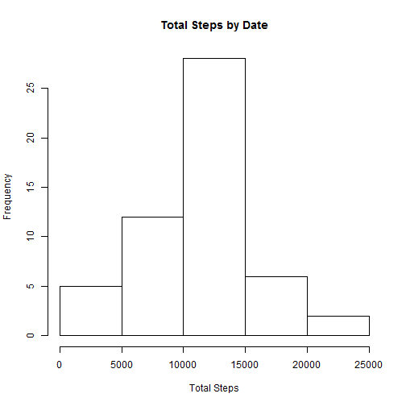
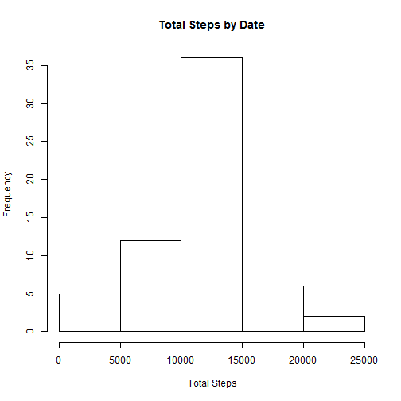
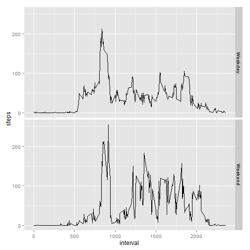

The following step will be to read the dataset into R Studio and load the necessary packages for this analysis

```r
dataset <- read.csv("ReproducibleResearch/activity.csv")
library(ggplot2)
library(dplyr)
```

Question 1: What is mean total number of steps taken per day?

Sub question 1.1: Calculate the total number of steps taken per day

```r
stepsbydate <- aggregate(steps ~ date, data = dataset, FUN=sum, na.rm=TRUE)
```

Sub question 1.2: Make a histogram of the total number of steps taken each day

```r
hist(stepsbydate$steps, main="Total Steps by Date", xlab ="Total Steps")
```

 

Sub question 1.3: Calculate and report the mean and median of the total number of steps taken per day. 
Let's start with the mean:

```r
avgsteps <- aggregate(steps ~ date, data = dataset, FUN=mean, na.rm=TRUE)
print(avgsteps)
```

```
##          date      steps
## 1  2012-10-02  0.4375000
## 2  2012-10-03 39.4166667
## 3  2012-10-04 42.0694444
## 4  2012-10-05 46.1597222
## 5  2012-10-06 53.5416667
## 6  2012-10-07 38.2465278
## 7  2012-10-09 44.4826389
## 8  2012-10-10 34.3750000
## 9  2012-10-11 35.7777778
## 10 2012-10-12 60.3541667
## 11 2012-10-13 43.1458333
## 12 2012-10-14 52.4236111
## 13 2012-10-15 35.2048611
## 14 2012-10-16 52.3750000
## 15 2012-10-17 46.7083333
## 16 2012-10-18 34.9166667
## 17 2012-10-19 41.0729167
## 18 2012-10-20 36.0937500
## 19 2012-10-21 30.6284722
## 20 2012-10-22 46.7361111
## 21 2012-10-23 30.9652778
## 22 2012-10-24 29.0104167
## 23 2012-10-25  8.6527778
## 24 2012-10-26 23.5347222
## 25 2012-10-27 35.1354167
## 26 2012-10-28 39.7847222
## 27 2012-10-29 17.4236111
## 28 2012-10-30 34.0937500
## 29 2012-10-31 53.5208333
## 30 2012-11-02 36.8055556
## 31 2012-11-03 36.7048611
## 32 2012-11-05 36.2465278
## 33 2012-11-06 28.9375000
## 34 2012-11-07 44.7326389
## 35 2012-11-08 11.1770833
## 36 2012-11-11 43.7777778
## 37 2012-11-12 37.3784722
## 38 2012-11-13 25.4722222
## 39 2012-11-15  0.1423611
## 40 2012-11-16 18.8923611
## 41 2012-11-17 49.7881944
## 42 2012-11-18 52.4652778
## 43 2012-11-19 30.6979167
## 44 2012-11-20 15.5277778
## 45 2012-11-21 44.3993056
## 46 2012-11-22 70.9270833
## 47 2012-11-23 73.5902778
## 48 2012-11-24 50.2708333
## 49 2012-11-25 41.0902778
## 50 2012-11-26 38.7569444
## 51 2012-11-27 47.3819444
## 52 2012-11-28 35.3576389
## 53 2012-11-29 24.4687500
```

And the same for the median values:

```r
mediansteps <- aggregate(steps ~ date, data = dataset, FUN=median, na.rm=TRUE)
print(mediansteps)
```

```
##          date steps
## 1  2012-10-02     0
## 2  2012-10-03     0
## 3  2012-10-04     0
## 4  2012-10-05     0
## 5  2012-10-06     0
## 6  2012-10-07     0
## 7  2012-10-09     0
## 8  2012-10-10     0
## 9  2012-10-11     0
## 10 2012-10-12     0
## 11 2012-10-13     0
## 12 2012-10-14     0
## 13 2012-10-15     0
## 14 2012-10-16     0
## 15 2012-10-17     0
## 16 2012-10-18     0
## 17 2012-10-19     0
## 18 2012-10-20     0
## 19 2012-10-21     0
## 20 2012-10-22     0
## 21 2012-10-23     0
## 22 2012-10-24     0
## 23 2012-10-25     0
## 24 2012-10-26     0
## 25 2012-10-27     0
## 26 2012-10-28     0
## 27 2012-10-29     0
## 28 2012-10-30     0
## 29 2012-10-31     0
## 30 2012-11-02     0
## 31 2012-11-03     0
## 32 2012-11-05     0
## 33 2012-11-06     0
## 34 2012-11-07     0
## 35 2012-11-08     0
## 36 2012-11-11     0
## 37 2012-11-12     0
## 38 2012-11-13     0
## 39 2012-11-15     0
## 40 2012-11-16     0
## 41 2012-11-17     0
## 42 2012-11-18     0
## 43 2012-11-19     0
## 44 2012-11-20     0
## 45 2012-11-21     0
## 46 2012-11-22     0
## 47 2012-11-23     0
## 48 2012-11-24     0
## 49 2012-11-25     0
## 50 2012-11-26     0
## 51 2012-11-27     0
## 52 2012-11-28     0
## 53 2012-11-29     0
```

Question 2 is around the average daily activity pattern based on the time interval. The question is: What is the average daily activity pattern?

Subquestion 2.1:
Make a time series plot of the 5-minute interval (x-axis) and the average number of steps taken:

```r
avgdailypattern <- aggregate(steps ~ interval, data = dataset, FUN=mean)
timeseries <- ggplot(avgdailypattern, aes(x=interval, y=steps)) + geom_line()
print(timeseries)
```

 

The follow up question is, which interval contains the maximum number of steps:

```r
maxinterval <- avgdailypattern[which.max(avgdailypattern$steps),]
print(maxinterval)
```

```
##     interval    steps
## 104      835 206.1698
```

As there are many NA values in the dataset, we are looking at how to attach values to these, first it is important to find out how many NA values there are in the current dataset:

```r
sum(is.na(dataset))
```

```
## [1] 2304
```

The next step is to create a new dataset where the NA values are replaced by the mean value for the same interva:

```r
newdataset <- dataset

avgsteps_perinterval <- newdataset %>% 
                   group_by(interval) %>%
                   summarise_each(funs(mean(steps, na.rm = TRUE)))
                 
avgsteps2 <- avgsteps_perinterval[,1:2]                 
                 
index_of_na <- which(is.na(newdataset$steps)) 

for (i in index_of_na) {
  newdataset$steps[i] <- with(avgsteps2, 
                                steps[interval == newdataset$interval[i]])
  
}
```

The following histogram presents the distribution of the total number of steps

```r
newtotaldailypattern <- aggregate(steps ~ date, data = newdataset, FUN=sum)
hist(newtotaldailypattern$steps, main = "Total Steps by Date" ,xlab =" Total Steps")
```

 

Then the mean and median total number of steps can be derived from the new dataset. Since the NA values are replaced by the mean, there is no difference between the first dataset and the new dataset with NAs replaced. Lets first look at the Mean values of the new dataset

```r
newavgdailypattern <- aggregate(steps ~ date, data = newdataset, FUN=mean)
print(newavgdailypattern)
```

```
##          date      steps
## 1  2012-10-01 37.3825996
## 2  2012-10-02  0.4375000
## 3  2012-10-03 39.4166667
## 4  2012-10-04 42.0694444
## 5  2012-10-05 46.1597222
## 6  2012-10-06 53.5416667
## 7  2012-10-07 38.2465278
## 8  2012-10-08 37.3825996
## 9  2012-10-09 44.4826389
## 10 2012-10-10 34.3750000
## 11 2012-10-11 35.7777778
## 12 2012-10-12 60.3541667
## 13 2012-10-13 43.1458333
## 14 2012-10-14 52.4236111
## 15 2012-10-15 35.2048611
## 16 2012-10-16 52.3750000
## 17 2012-10-17 46.7083333
## 18 2012-10-18 34.9166667
## 19 2012-10-19 41.0729167
## 20 2012-10-20 36.0937500
## 21 2012-10-21 30.6284722
## 22 2012-10-22 46.7361111
## 23 2012-10-23 30.9652778
## 24 2012-10-24 29.0104167
## 25 2012-10-25  8.6527778
## 26 2012-10-26 23.5347222
## 27 2012-10-27 35.1354167
## 28 2012-10-28 39.7847222
## 29 2012-10-29 17.4236111
## 30 2012-10-30 34.0937500
## 31 2012-10-31 53.5208333
## 32 2012-11-01 37.3825996
## 33 2012-11-02 36.8055556
## 34 2012-11-03 36.7048611
## 35 2012-11-04 37.3825996
## 36 2012-11-05 36.2465278
## 37 2012-11-06 28.9375000
## 38 2012-11-07 44.7326389
## 39 2012-11-08 11.1770833
## 40 2012-11-09 37.3825996
## 41 2012-11-10 37.3825996
## 42 2012-11-11 43.7777778
## 43 2012-11-12 37.3784722
## 44 2012-11-13 25.4722222
## 45 2012-11-14 37.3825996
## 46 2012-11-15  0.1423611
## 47 2012-11-16 18.8923611
## 48 2012-11-17 49.7881944
## 49 2012-11-18 52.4652778
## 50 2012-11-19 30.6979167
## 51 2012-11-20 15.5277778
## 52 2012-11-21 44.3993056
## 53 2012-11-22 70.9270833
## 54 2012-11-23 73.5902778
## 55 2012-11-24 50.2708333
## 56 2012-11-25 41.0902778
## 57 2012-11-26 38.7569444
## 58 2012-11-27 47.3819444
## 59 2012-11-28 35.3576389
## 60 2012-11-29 24.4687500
## 61 2012-11-30 37.3825996
```

Then the new median values:

```r
newmediandailypattern <- aggregate(steps ~ date, data = newdataset, FUN=median)
print(newmediandailypattern)
```

```
##          date    steps
## 1  2012-10-01 34.11321
## 2  2012-10-02  0.00000
## 3  2012-10-03  0.00000
## 4  2012-10-04  0.00000
## 5  2012-10-05  0.00000
## 6  2012-10-06  0.00000
## 7  2012-10-07  0.00000
## 8  2012-10-08 34.11321
## 9  2012-10-09  0.00000
## 10 2012-10-10  0.00000
## 11 2012-10-11  0.00000
## 12 2012-10-12  0.00000
## 13 2012-10-13  0.00000
## 14 2012-10-14  0.00000
## 15 2012-10-15  0.00000
## 16 2012-10-16  0.00000
## 17 2012-10-17  0.00000
## 18 2012-10-18  0.00000
## 19 2012-10-19  0.00000
## 20 2012-10-20  0.00000
## 21 2012-10-21  0.00000
## 22 2012-10-22  0.00000
## 23 2012-10-23  0.00000
## 24 2012-10-24  0.00000
## 25 2012-10-25  0.00000
## 26 2012-10-26  0.00000
## 27 2012-10-27  0.00000
## 28 2012-10-28  0.00000
## 29 2012-10-29  0.00000
## 30 2012-10-30  0.00000
## 31 2012-10-31  0.00000
## 32 2012-11-01 34.11321
## 33 2012-11-02  0.00000
## 34 2012-11-03  0.00000
## 35 2012-11-04 34.11321
## 36 2012-11-05  0.00000
## 37 2012-11-06  0.00000
## 38 2012-11-07  0.00000
## 39 2012-11-08  0.00000
## 40 2012-11-09 34.11321
## 41 2012-11-10 34.11321
## 42 2012-11-11  0.00000
## 43 2012-11-12  0.00000
## 44 2012-11-13  0.00000
## 45 2012-11-14 34.11321
## 46 2012-11-15  0.00000
## 47 2012-11-16  0.00000
## 48 2012-11-17  0.00000
## 49 2012-11-18  0.00000
## 50 2012-11-19  0.00000
## 51 2012-11-20  0.00000
## 52 2012-11-21  0.00000
## 53 2012-11-22  0.00000
## 54 2012-11-23  0.00000
## 55 2012-11-24  0.00000
## 56 2012-11-25  0.00000
## 57 2012-11-26  0.00000
## 58 2012-11-27  0.00000
## 59 2012-11-28  0.00000
## 60 2012-11-29  0.00000
## 61 2012-11-30 34.11321
```

To see the actual differences between the new dataset and the old dataset, the following table will present this:

```r
mergedavg <- merge(newavgdailypattern, avgsteps, by ="date", all=TRUE)
avgdiff <- mutate(mergedavg, StepsDifference = steps.x - steps.y)
print(avgdiff)
```

```
##          date    steps.x    steps.y StepsDifference
## 1  2012-10-01 37.3825996         NA              NA
## 2  2012-10-02  0.4375000  0.4375000               0
## 3  2012-10-03 39.4166667 39.4166667               0
## 4  2012-10-04 42.0694444 42.0694444               0
## 5  2012-10-05 46.1597222 46.1597222               0
## 6  2012-10-06 53.5416667 53.5416667               0
## 7  2012-10-07 38.2465278 38.2465278               0
## 8  2012-10-08 37.3825996         NA              NA
## 9  2012-10-09 44.4826389 44.4826389               0
## 10 2012-10-10 34.3750000 34.3750000               0
## 11 2012-10-11 35.7777778 35.7777778               0
## 12 2012-10-12 60.3541667 60.3541667               0
## 13 2012-10-13 43.1458333 43.1458333               0
## 14 2012-10-14 52.4236111 52.4236111               0
## 15 2012-10-15 35.2048611 35.2048611               0
## 16 2012-10-16 52.3750000 52.3750000               0
## 17 2012-10-17 46.7083333 46.7083333               0
## 18 2012-10-18 34.9166667 34.9166667               0
## 19 2012-10-19 41.0729167 41.0729167               0
## 20 2012-10-20 36.0937500 36.0937500               0
## 21 2012-10-21 30.6284722 30.6284722               0
## 22 2012-10-22 46.7361111 46.7361111               0
## 23 2012-10-23 30.9652778 30.9652778               0
## 24 2012-10-24 29.0104167 29.0104167               0
## 25 2012-10-25  8.6527778  8.6527778               0
## 26 2012-10-26 23.5347222 23.5347222               0
## 27 2012-10-27 35.1354167 35.1354167               0
## 28 2012-10-28 39.7847222 39.7847222               0
## 29 2012-10-29 17.4236111 17.4236111               0
## 30 2012-10-30 34.0937500 34.0937500               0
## 31 2012-10-31 53.5208333 53.5208333               0
## 32 2012-11-01 37.3825996         NA              NA
## 33 2012-11-02 36.8055556 36.8055556               0
## 34 2012-11-03 36.7048611 36.7048611               0
## 35 2012-11-04 37.3825996         NA              NA
## 36 2012-11-05 36.2465278 36.2465278               0
## 37 2012-11-06 28.9375000 28.9375000               0
## 38 2012-11-07 44.7326389 44.7326389               0
## 39 2012-11-08 11.1770833 11.1770833               0
## 40 2012-11-09 37.3825996         NA              NA
## 41 2012-11-10 37.3825996         NA              NA
## 42 2012-11-11 43.7777778 43.7777778               0
## 43 2012-11-12 37.3784722 37.3784722               0
## 44 2012-11-13 25.4722222 25.4722222               0
## 45 2012-11-14 37.3825996         NA              NA
## 46 2012-11-15  0.1423611  0.1423611               0
## 47 2012-11-16 18.8923611 18.8923611               0
## 48 2012-11-17 49.7881944 49.7881944               0
## 49 2012-11-18 52.4652778 52.4652778               0
## 50 2012-11-19 30.6979167 30.6979167               0
## 51 2012-11-20 15.5277778 15.5277778               0
## 52 2012-11-21 44.3993056 44.3993056               0
## 53 2012-11-22 70.9270833 70.9270833               0
## 54 2012-11-23 73.5902778 73.5902778               0
## 55 2012-11-24 50.2708333 50.2708333               0
## 56 2012-11-25 41.0902778 41.0902778               0
## 57 2012-11-26 38.7569444 38.7569444               0
## 58 2012-11-27 47.3819444 47.3819444               0
## 59 2012-11-28 35.3576389 35.3576389               0
## 60 2012-11-29 24.4687500 24.4687500               0
## 61 2012-11-30 37.3825996         NA              NA
```

The same is done for the median values:

```r
mergedmedian <- merge(newmediandailypattern, mediansteps, by ="date", all=TRUE)
mediandiff <- mutate(mergedmedian, StepsDifference = steps.x - steps.y)
print(mediandiff)
```

```
##          date  steps.x steps.y StepsDifference
## 1  2012-10-01 34.11321      NA              NA
## 2  2012-10-02  0.00000       0               0
## 3  2012-10-03  0.00000       0               0
## 4  2012-10-04  0.00000       0               0
## 5  2012-10-05  0.00000       0               0
## 6  2012-10-06  0.00000       0               0
## 7  2012-10-07  0.00000       0               0
## 8  2012-10-08 34.11321      NA              NA
## 9  2012-10-09  0.00000       0               0
## 10 2012-10-10  0.00000       0               0
## 11 2012-10-11  0.00000       0               0
## 12 2012-10-12  0.00000       0               0
## 13 2012-10-13  0.00000       0               0
## 14 2012-10-14  0.00000       0               0
## 15 2012-10-15  0.00000       0               0
## 16 2012-10-16  0.00000       0               0
## 17 2012-10-17  0.00000       0               0
## 18 2012-10-18  0.00000       0               0
## 19 2012-10-19  0.00000       0               0
## 20 2012-10-20  0.00000       0               0
## 21 2012-10-21  0.00000       0               0
## 22 2012-10-22  0.00000       0               0
## 23 2012-10-23  0.00000       0               0
## 24 2012-10-24  0.00000       0               0
## 25 2012-10-25  0.00000       0               0
## 26 2012-10-26  0.00000       0               0
## 27 2012-10-27  0.00000       0               0
## 28 2012-10-28  0.00000       0               0
## 29 2012-10-29  0.00000       0               0
## 30 2012-10-30  0.00000       0               0
## 31 2012-10-31  0.00000       0               0
## 32 2012-11-01 34.11321      NA              NA
## 33 2012-11-02  0.00000       0               0
## 34 2012-11-03  0.00000       0               0
## 35 2012-11-04 34.11321      NA              NA
## 36 2012-11-05  0.00000       0               0
## 37 2012-11-06  0.00000       0               0
## 38 2012-11-07  0.00000       0               0
## 39 2012-11-08  0.00000       0               0
## 40 2012-11-09 34.11321      NA              NA
## 41 2012-11-10 34.11321      NA              NA
## 42 2012-11-11  0.00000       0               0
## 43 2012-11-12  0.00000       0               0
## 44 2012-11-13  0.00000       0               0
## 45 2012-11-14 34.11321      NA              NA
## 46 2012-11-15  0.00000       0               0
## 47 2012-11-16  0.00000       0               0
## 48 2012-11-17  0.00000       0               0
## 49 2012-11-18  0.00000       0               0
## 50 2012-11-19  0.00000       0               0
## 51 2012-11-20  0.00000       0               0
## 52 2012-11-21  0.00000       0               0
## 53 2012-11-22  0.00000       0               0
## 54 2012-11-23  0.00000       0               0
## 55 2012-11-24  0.00000       0               0
## 56 2012-11-25  0.00000       0               0
## 57 2012-11-26  0.00000       0               0
## 58 2012-11-27  0.00000       0               0
## 59 2012-11-28  0.00000       0               0
## 60 2012-11-29  0.00000       0               0
## 61 2012-11-30 34.11321      NA              NA
```

Finally, the impact of imputting missing data on the estimates of the total number of steps is as follows:

```r
mergedsum <- merge(newtotaldailypattern, stepsbydate, by="date", all=TRUE)
totaldiff <- mutate(mergedsum, StepsDifference = steps.x - steps.y)
print(totaldiff)
```

```
##          date  steps.x steps.y StepsDifference
## 1  2012-10-01 10766.19      NA              NA
## 2  2012-10-02   126.00     126               0
## 3  2012-10-03 11352.00   11352               0
## 4  2012-10-04 12116.00   12116               0
## 5  2012-10-05 13294.00   13294               0
## 6  2012-10-06 15420.00   15420               0
## 7  2012-10-07 11015.00   11015               0
## 8  2012-10-08 10766.19      NA              NA
## 9  2012-10-09 12811.00   12811               0
## 10 2012-10-10  9900.00    9900               0
## 11 2012-10-11 10304.00   10304               0
## 12 2012-10-12 17382.00   17382               0
## 13 2012-10-13 12426.00   12426               0
## 14 2012-10-14 15098.00   15098               0
## 15 2012-10-15 10139.00   10139               0
## 16 2012-10-16 15084.00   15084               0
## 17 2012-10-17 13452.00   13452               0
## 18 2012-10-18 10056.00   10056               0
## 19 2012-10-19 11829.00   11829               0
## 20 2012-10-20 10395.00   10395               0
## 21 2012-10-21  8821.00    8821               0
## 22 2012-10-22 13460.00   13460               0
## 23 2012-10-23  8918.00    8918               0
## 24 2012-10-24  8355.00    8355               0
## 25 2012-10-25  2492.00    2492               0
## 26 2012-10-26  6778.00    6778               0
## 27 2012-10-27 10119.00   10119               0
## 28 2012-10-28 11458.00   11458               0
## 29 2012-10-29  5018.00    5018               0
## 30 2012-10-30  9819.00    9819               0
## 31 2012-10-31 15414.00   15414               0
## 32 2012-11-01 10766.19      NA              NA
## 33 2012-11-02 10600.00   10600               0
## 34 2012-11-03 10571.00   10571               0
## 35 2012-11-04 10766.19      NA              NA
## 36 2012-11-05 10439.00   10439               0
## 37 2012-11-06  8334.00    8334               0
## 38 2012-11-07 12883.00   12883               0
## 39 2012-11-08  3219.00    3219               0
## 40 2012-11-09 10766.19      NA              NA
## 41 2012-11-10 10766.19      NA              NA
## 42 2012-11-11 12608.00   12608               0
## 43 2012-11-12 10765.00   10765               0
## 44 2012-11-13  7336.00    7336               0
## 45 2012-11-14 10766.19      NA              NA
## 46 2012-11-15    41.00      41               0
## 47 2012-11-16  5441.00    5441               0
## 48 2012-11-17 14339.00   14339               0
## 49 2012-11-18 15110.00   15110               0
## 50 2012-11-19  8841.00    8841               0
## 51 2012-11-20  4472.00    4472               0
## 52 2012-11-21 12787.00   12787               0
## 53 2012-11-22 20427.00   20427               0
## 54 2012-11-23 21194.00   21194               0
## 55 2012-11-24 14478.00   14478               0
## 56 2012-11-25 11834.00   11834               0
## 57 2012-11-26 11162.00   11162               0
## 58 2012-11-27 13646.00   13646               0
## 59 2012-11-28 10183.00   10183               0
## 60 2012-11-29  7047.00    7047               0
## 61 2012-11-30 10766.19      NA              NA
```


The last part of this assignment deals with the number of steps by day of the week. The first step for this analysis is to create new variable which indicates whether the date is a weekday or weekend:

```r
newdataset$date <- as.POSIXct(newdataset$date)
newdataset$Weekday <- weekdays(newdataset$date, abbreviate = FALSE)
newdataset$DoWFlag <- ifelse(newdataset$Weekday == "Saturday" | newdataset$Weekday == "Saturday" , "Weekend", "Weekday")
newdataset$DoWFlag <- as.factor(newdataset$DoWFlag)
```

To see any difference between the two factors (Weekday or Weekend) a plot is created:

```r
avgbydayofweek <- aggregate(steps ~ interval * DoWFlag, data = newdataset, FUN=mean)
lastplot <- ggplot(avgbydayofweek, aes(x=interval, y=steps)) + geom_line()
lastplot + facet_grid(DoWFlag ~.)
```

 

## The end!
